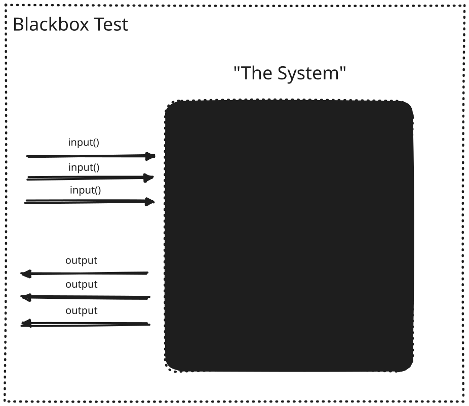
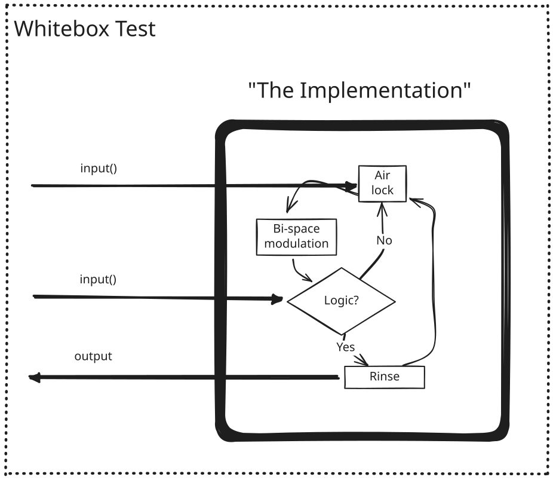
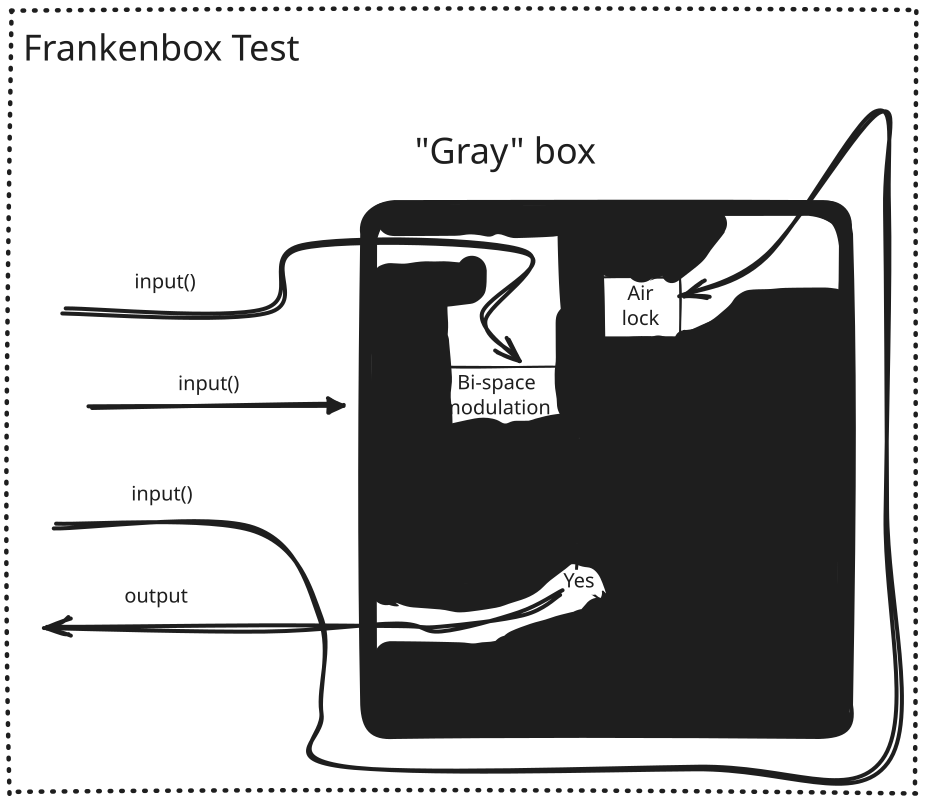
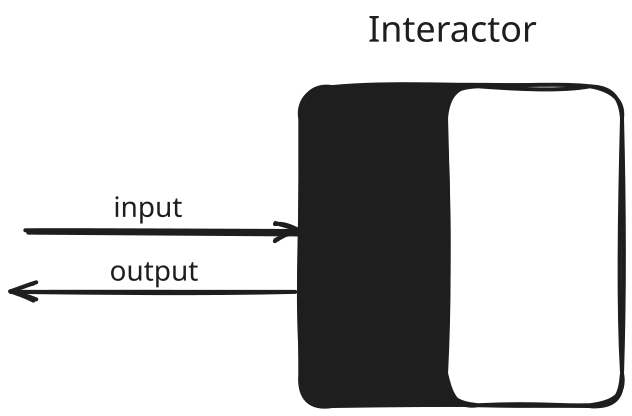
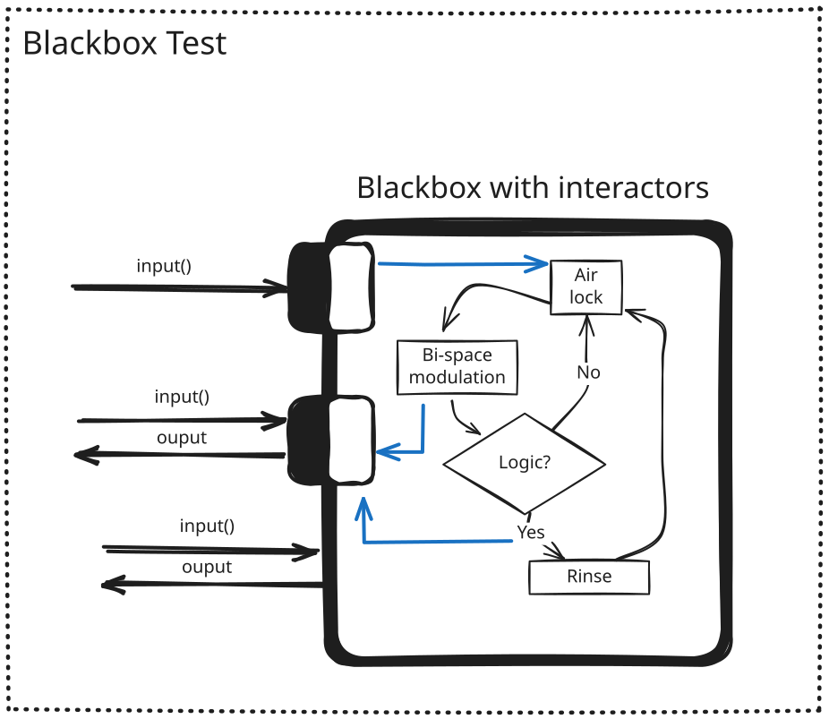

Have you ever heard the idea that “graybox testing is just blend of whitebox
testing and blackbox testing” before? The claim is usually accompanied by some
variation of this pat graphic.

The term “graybox” sounds nice on the surface as a balance of tradeoffs between
blackbox and whitebox, but more often than not, the attempt to actually
construct one results in what I call the _Frankenbox,_ an ad-hoc mixing of
abstraction layers that creates more issues than it solves. It matters because
test suites built on top of _frankenboxes_ are constantly breaking, reporting
false negatives, and eventually getting disabled as software teams lose faith in
them.

### A brief recap: blackbox vs whitebox testing

We say that a test is “blackbox” test if it requires zero knowledge of how the
system it is testing actually works. When we write one, we force ourselves to
treat the system as a completely opaque entity about which we can only learn
things by sending it inputs and observing the resulting outputs.

This is a great model for testing software because it lines up perfectly with
the way software is used. Whether it is a library of functions, or it is a full
blown REST application, the callers of a software system must, by definition,
interact with it exclusively as a black box. There is simply no better way to
verify correctness of behavior than by enforcing that each test should conduct
itself as a real life caller would.

<figcaption>A blackbox can be known only by its inputs and outputs</figcaption>

While the blackbox test might represent the platonic ideal of what a test should
be, how exactly to we go about making one? For example, in an end-to-end test,
what happens if you need to create a new user before every run? You might have
to use a private API. And what if after that user is created, the test needs to
wait for an unknown time for that user to become available because you’re using
micro services and your state is only eventually consistent? Or even more
simply, what if the only way to find the “Submit” button is by knowing a very
specific CSS selector or a test id?

To do these things, your only option is to pierce the veil of abstraction and
allow the test to have specific knowledge of the system so that it can
manipulate it directly from the inside. We call tests like these “whitebox”
tests because to them, the system under test is transparent; they can see
through the public facing API in order to read and manipulate the underlying
internals.

Whitebox tests provide one answer to the challenges of a blackbox test… If we
need to connect directly to Postgres, we can. If we need to use a CSS class or a
test id, we do. Whatever state we need to read in order to complete our test is
all there right in front of us.

<figcaption>A whitebox test can interact with the system anywhere</figcaption>

But whitebox tests are problematic too because they are coupled to the internals
of a system and not its public facing API. As a result, you cannot change the
implementation of your system without breaking your whitebox tests. Switching
from MySQL to Postgres? Break. Moving from AWS to Azure for bucket storage?
Break. Did you just restyle your custom button component to change the markup
and CSS? Broken again.

Worst of all: a whitebox test doesn’t actually verify that your system works
because it’s using levers and knobs that simply don’t exist for your users.

### Graybox Testing: the myth of a perfect blend

As a result, the consensus is that blackbox testing is what you _want_ to do for
the sake of correctness, but whitebox testing is what you _have_ to for the sake
of practicality. That brings us back to the hypothetical “graybox”; a hybrid
approach that uses blackbox wherever it can, but resorts to whitebox whenever it
must.

<figcaption>A graybox perfectly blends the analogies of a blackbox and a whitebox</figcaption>

This seems plausible at first because we’re using elements from both techniques
and “mixing” them together. But ultimately the concept is misleading. What makes
the blackbox and whitebox formulation compelling is that they provide guidance
about where the _boundaries_ should be drawn in your tests. “Graybox” on the
other hand, completely erases the concept of boundaries which made the original
analogies useful in the first place.

In the real world, you have to make real decisions about where to draw the line
between which private APIs you are going to use, and which ones you won’t, and
so in actuality, the “graybox” is not a smooth blending of black and white
boxes, but rather a set of private API carve-outs that are cobbled together
according to the needs of the current moment. In other words: a _frankenbox._

<figcaption>A Frankenbox is a blackbox that has been punctured, bolted and wired with ad-hoc carve-outs for implementation details.</figcaption>

Frankenboxes don’t scale because they create invisible bonds coupling tests to
an implementation. These bonds are hidden from developers, so they are
constantly severing them unknowingly as they change and evolve the system. And
if breakage occur often enough, the team will lose faith in the test suite and
begin to ignore the failures it surfaces rather than investigate them. Your
tests are now a millstone around your neck instead of the force multiplier they
were supposed to be.

Compound this problem across all the unique Frankenboxes each development team
creates for its own tests, and it’s no wonder that so many test suites crash and
burn.

### Page Objects: A case study in (suboptimal) mitigation

While not universal, there _is_ some prior art out there that can shield you
from creating a frankenbox test. In the frontend testing space, we commonly use
a pattern called the
[*Page Object](https://martinfowler.com/bliki/PageObject.html).* According to
Fowler:

> When you write tests against a web page, you need to refer to elements within
> that web page in order to click links and determine what's displayed. However,
> if you write tests that manipulate the HTML elements directly your tests will
> be brittle to changes in the UI. A page object wraps an HTML page, or
> fragment, with an application-specific API, allowing you to manipulate page
> elements without digging around in the HTML.

In other words, page objects explicitly limit your exposure to the details of a
system’s internals in order to make your tests robust in the face of change.
While page object libraries have not kept up with the sophistication required of
the applications we write today, they do provide a very important clue regarding
the way forward.

### Interactors are explicitly organized blackboxes and whiteboxes.

You cannot avoid exposing some of your system internals to your tests. However,
what countermeasures like page objects show us is that what you _can_ do is be
up-front about which internals you expose by encapsulating them within a
dedicated and stable API. At Frontside, we do this with a universal pattern we
call _The Interactor._

There is no restriction on what an interactor can interact with: the UI, the
backend, or even a third party service, but at its core, an interactor is an API
split into two halves: a blackbox and a whitebox. The whitebox side of the
interactor is allowed to have complete knowledge of a slice of the system, while
the blackbox side presents a stable API that the tests can rely on to function
regardless of how the internal details change. In other words, each interactor
is a minimal whitebox packaged within a black box.

Interactors provide two key advantages. First, unlike with the frankenbox, tests
that use them are insulated from breaking changes because they do not use any
implementation details of the system. Instead, they only use the public
interface of the interactor, which is a blackbox. Second, and this cannot be
understated, interactors are _re-usable_ software components in their own right.
They can be distributed independently and be used by _any_ test suite to turn
its frankenbox into a well-ordered composition of black and white boxes. You
really start to reap the benefits when three or more of your teams each stop
building their own unique _frankenboxes_ and start using a shared set of
battle-tested interactors that let them focus on writing tests rather than
wasting time maintaining them.

<figcaption>An interactor test only uses dedicated and stable APIs to read and manipulate system state</figcaption>

In a future post, we’ll discuss how to divide labor and responsibilities for
interactor based tests between your QA team, your developers, and your
engineering managers, but the most important take away from our experience is
this:

### Interactors make test suites successful

Whether you are using them for your UI, your backend, a third party service, or
something else entirely, interactors make your tests easier to write for all
your teams, and at the same time it makes them more resilient to change as your
software evolves. Stop creating frankenboxes, start using interactors. You’ll be
glad you did.
