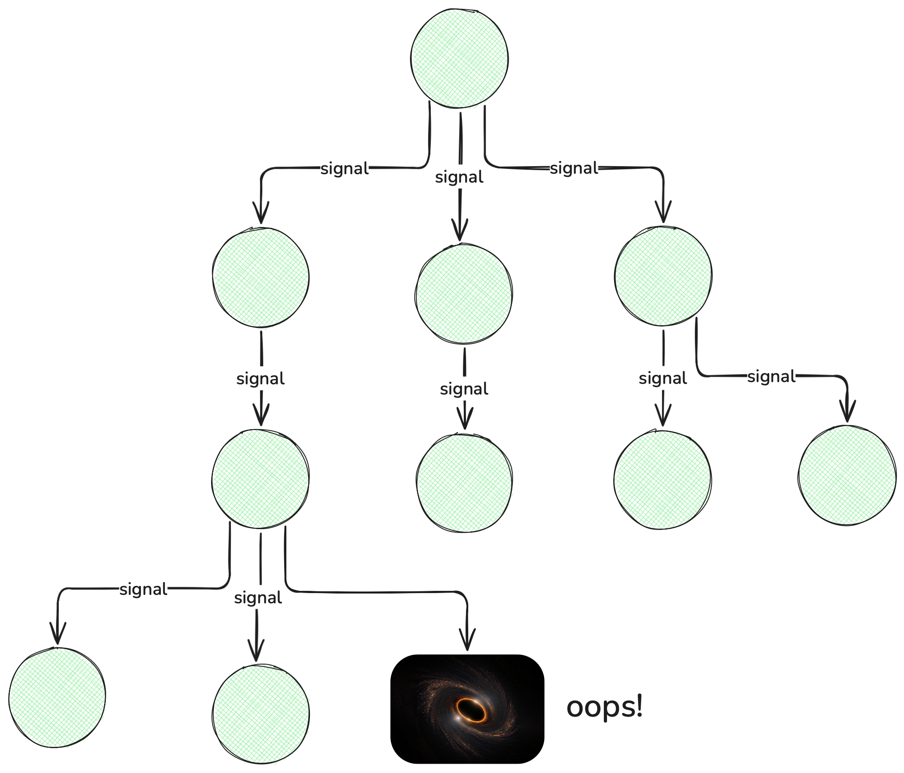

What is it about `AbortController` and its companion `AbortSignal` that keeps
developers from reaching for it while designing their APIs? If it’s the official
method of cancelling operations, then why don’t we see more of it in the wild?
It’s hard to pinpoint any one thing that’s wrong about it. The API is simple
enough and easy to understand. It builds on existing art that is widespread and
well understood in the form of `EventTarget`, and yet its usage remains more the
exception than the rule. I believe that this is because it is not only
cumbersome and fragile, but also that it lacks fundamental capabilities that are
required for a cancellation primitive.

## AbortController.abort() is an aspiration, not a constraint.

Sure, you can pass an `AbortSignal` to an async function but you must
not only trust that it uses it correctly (more on what this means
later…), but also that it properly passes the signal along to any of
the async functions that _it_ calls. And, each of _those_ functions
must in turn pass the signal to each of the async functions that
_they_ call; and so on and so forth down an unbounded and
exponentially expanding call stack. Any breaking of the
signal passing chain whatsoever, be it in your application code or a
3rd party library and boom! You’re [stuck beyond the await event
horizon](https://frontside.com/blog/2023-12-11-await-event-horizon/).



A tree of asynchronous function calls cannot forget to pass the abort
signal down to _every_ operation, otherwise it risks becoming stuck
forever; with every single `await` becoming a possible trap.

Given the conspicuous non-presence of signal passing in JavaScript code
everywhere, this outcome is more a mathematical certainty than anything else.
But even if you could find a way to thread an abort signal through every single
async function call in your codebase, what does using it correctly mean anyway?
[There is no consensus.](https://news.ycombinator.com/item?id=13214487)

One common way is to race the abort signal against every piece of asynchronous
work that the function does, and raise an error in the event of cancellation.
This presents an API similar to `fetch()` and other platform apis that either
return a value or raise an `AbortError` if cancelled.

```jsx
async function work(signal) {
  let aborted = new Promise((_, reject) => {
    signal.addEventListener("abort", () => reject(new Error("AbortError"));
  });
  await Promise.race([doSomething(signal), aborted]);
  await Promise.race([doSomethingElse(signal), aborted]);
  return await Promise.race([doAnotherThing(signal), aborted]);
}
```

This works, but the sheer noise of it is enough to make most
developers shrug and not bother.

However, it isn’t just writing such functions that pose a problem, consuming
them is also an issue. For example, what if you actually want to handle errors
in your application (which is something that most of us end up wanting to do at
_some_ point). Well, because cancellation is shoe-horned into the call stack as
an error, you have to add boilerplate to every single `catch {}` statement in
the application in order to propagate the cancellation properly.

```jsx
try {
  return await work(signal);
} catch (error) {
  if (error.name === "AbortError") {
    throw error; //propagate cancellation
  }
  console.log(`error doing work: ${error}`);
}
```

If we fail to do this even once in any of our `try/catch`, then cancellation is stopped dead in its
tracks. Few would know to do this, and those that would don't because
it's tedious, and so nobody does unless they're specifically working
around a cancellation bug.

In fact, a GitHub search for the snippet
[`if (error.name === "AbortError")`](https://github.com/search?q=error.name+%3D%3D%3D+AbortError&type=code)
shows that this is a very common complexity added to your workday catch block.

There are many other ways to a consume an abort signal that I won’t go into such
as wrapping every abortable function’s result in a
“[maybe value](https://engineering.dollarshaveclub.com/typescript-maybe-type-and-module-627506ecc5c8)”.
The point though is that there is no single way, and there never will be, and so
functions written with one set of abort signal conventions will not be
composable with functions using with another.

## Shutdown is part of the computation

Perhaps the greatest shortcoming of all is that `controller.abort()` is a
synchronous function that _requests_ a cancellation, but it does not provide any
mechanism to detect _when_ and _how_ the cancellation completed. This makes it
exceedingly difficult to make programming decisions based on what happens when
you abort an operation.

For example, suppose you want to write a simple supervisor that periodically
restarts a set of three services every two minutes. In order to be correct, you
can’t start the next set of three until the old set of three have been
completely shutdown. Otherwise, you might leave file handles open, server ports
still bound, or any other kind of resource leakage. To do that, we’d like to be
able to “await” the outcome of the cancellation.

```tsx
async function main() {
  while (true) {
    let controller = new AbortController();
    let { signal } = controller;

      await startServiceOne(signal),
      await startServiceTwo(signal),
      await startServiceThree(signal),
      await sleep(120_000);

    /* Alas, if only we could `await` cancellation. However, we cannot */
    await controller.abort();
  }
}
```

Not only would our supervision loop resume at just the right time, but also if
there is a problem with the teardown itself, an error would be raised right at
the moment of cancellation which we must either handle, or allow to propagate 
before attempting another turn of the loop.

The bad news is of course, that no matter how much we wish abort controllers
worked this way, the fact of the matter is that they do not. Instead of being a
general tool for coordinating shutdown, they are nothing more than a channel
that communicates an intent to do so. And when we use them, we are forced to
muddle through the actual work of an orderly cancellation and hope that all the
functions we pass our signal too can do the same. It should go without saying
however that robust APIs are not built on hope.

There is some good news though: You don’t have to deal with the headaches of an
abort controller _at all_ when you have a
[structured concurrency](https://vorpus.org/blog/notes-on-structured-concurrency-or-go-statement-considered-harmful/)
library like [Effection](https://frontside.com/effection) on your side.
That’s because the lifetime of an operation is not determined by a mutable
object like an abort signal, but is instead determined by the _lexical
structure_ of your program. So the above example could be written much more
clearly  as:

```tsx
function* main() {
  while (true) {
    yield* scoped(function* () {
      yield* startServiceOne(),
      yield* startServiceTwo(),
      yield* startServiceThree(),
      yield* sleep(120_000);
    });
  }
}
```

The key here is that the `scoped()` function declares that anything started
inside its body needs to be shut down before it can return… which means that you
get a fresh set of services with each turn of the loop. No awkward apis, no
wobbly signal passing, just __program execution mirroring program text_.

### Structured Concurrency for the win

`AbortController` seems like a reasonable interface at first. It is
simple, easy to understand, and it follows the established pattern of
all the other event based APIs already present in the ecosystem. Its
fatal flaw however, is that it arrived outside the context of the
actual problem that needs solving: that concurrent tasks, just like
local variables, should have their lifetimes constrained by the
lexical scope in which they appear. This fundamental misalignment
is the reason that `AbortController` has not, and will not emerge as a
general solution to the problem of cancellation. If it was going to,
it would have already, and so it will remain a persistent
disappointment to all those attempting to use it in anger.

So I'll end by saying that if you've ever been frustrated by manually
managing cancellation, I'd invite you to give
[Effection](https://frontside.com/effection), or any other structured
concurrency library a try. _Zero_ effort cancellation? Feels great man.
