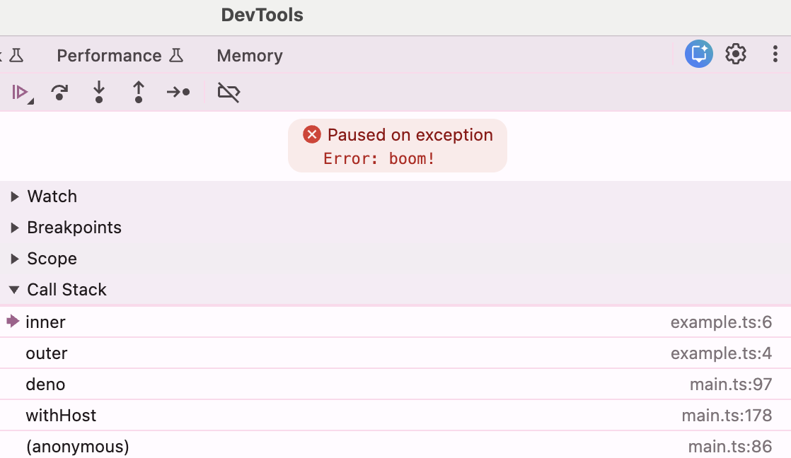

# Announcing Effection 4.0

Two years ago, In December of 2023, we released Effection 3.0 to the world. Consisting of  a complete API overhaul, we drastically reduced the surface area, and aligned it nearly point for point with Vanilla Javascript. It has been remarkably stable since then, and as a result we’ve had the joy of spending the last two years working *with* Effection rather than working *on* Effection. But we’ve also been watching and listening to the ways that Effection is being used in the wild which has allowed us to make some big time improvements based on it. That’s why we’re happy to announce that these improvements are finally ready to share with the community in the form of Effection 4.0!

While this is a major server release, almost all of the work happened below the surface of the public API. As a result, the number of breaking changes it contains is minimal. That’s great news, because it means that after following a gentle upgrade path, you’ll be able to benefit from some big power ups. Here is a list of our favorites:

- [🎯 Stricter execution order for more deterministic computations](#deterministic-executing-order)
- [✨ The new `scoped()` api: a dead simple way to contain the effects of any operation](#the-new-scoped-api)
- [⚡️Size and speed: a zero dependency rewrite of the internal APIs for maximal performance](#toll-free-stack-traces)
- [⚙️ Deeper platform sympathy: native, complete stack traces for every task](#introducing-effection-extensions)
- [🌐 Effection Extensions: a repository of community contributed modules](️#a-tinier-speedier-and-more-readable-runtime)

## 🎯 Deterministic Executing Order

In Effection 3.x, task code will run immediately whenever an event comes in that causes it
to resume. For example, a child task spawned in the background would start executing immediately, even while its parent was still running synchronous code. It doesn’t matter if the task sits at the root of the tree, or 100 levels deep. This led to cases where code that was technically out of scope was allowed to run even after it had passed its lifetime.

Effection 4.x changes this: a parent task always has priority over its children. This change makes task execution more predictable and allows parents to always have the necessary priority required to supervise the execution of their children. However, it does mean that if your v3 code relied on implicit ordering of child tasks, you might need to adjust your approach. Read more about it in the [upgrade guide](https://frontside.com/effection/guides/v4/upgrade/#task-execution-priority)

## ✨ The new `scoped()` api

*The* superpower of Structured Concurrency is the ability to contain all side-effects inside a single lexical scope. That way, when program execution passes out of a lexical scope, every piece of state contained within can be torn down. But in Effection 3.x  and earlier, this capability was only *implicit*. You could create a new scope by using `action()` , `call()` or `spawn()` but these were merely by-products of the implementation. Users found it confusing about when exactly a new scope was being introduced. For example, when is `task` exited?

```js
await run(function* example() {
  let task = yield* call(function*() {
    return yield* spawn(function*() {
      yield* sleep(200);
      console.log('task done')
    });
  });

  yield* sleep(500);
  console.log('all done!');
});
```

The answer is that in Effection 3, it will be halted immediately when `call()` returns on line (2) because an invisible scope is wrapped around every operation in a call.

To solve this confusion, simplify the API, and separate concerns, Effection V4 adds the new `scoped()` function.

It encapsulates an operation so that no effects will persist outside of it, shutting down all active effects like concurrent tasks and resources. In addition, all contexts are restored to their values once the operation exits, giving you a clean boundary where you can temporarily modify contextual values without worrying about polluting the outer scope.

And the best part is that we’ve back-ported it to Effection 3.2.0 and later so that you can use in your V3 apps right now!

## ⚙️ Toll free stack traces

Despite its [fatal flaws](https://frontside.com/blog/2023-12-11-await-event-horizon/), One of the great strengths of  `async/await` is its deep integration with the JavaScript platform. For example, if an error occurs in asynchronous code, The JavaScript runtime will stitch together the trace of asynchronous operations for you without any extra work by you or your framework code. This trace is understood not only by a developer reading it, but even more importantly it is understood by a host of developer tools including IDE’s, LSPs, and Debuggers. This may seem like a small thing, but it is a [constant source of annoyance](https://stackoverflow.com/questions/40064857/how-to-get-the-stacktrace-of-an-error-when-using-rxjs) when using frameworks that manage asynchronous effects. Most either punt on the problem entirely, or require you to have [special apis and instrumentation](https://www.typekaizen.com/posts/sentry-effect/) just in order to harvest a stack.

With Effection, our goal is not to replace JavaScript, but to embrace it with the power of Structured Concurrency. That’s why we’ve made it so that Effection programs live and breaths on the JavaScript stack. You’d expect a simple stack trace from this program:

```js
import { main, sleep, spawn, call } from "effection";

await main(function* outer() {
  yield* call(function* inner() {
    yield* sleep(100);
    throw new Error(`boom!`);
  });
});
```

And that’s just what you get:

```shell
Error: boom!
    at inner (example.ts:6:11)
    at inner.next (<anonymous>)
    at outer (example.ts:4:10)
    at outer.next (<anonymous>)
    at Object.deno (effection/lib/main.ts:97:22)
    at deno.next (<anonymous>)
    at withHost (effection/lib/main.ts:178:22)
    at withHost.next (<anonymous>)
    at effection/lib/main.ts:86:16
```

Whether you’re executing in the console, or you’re viewing from a breakpoint in devtools



## 🌐 Introducing Effection Extensions

When we released Effection v3, we set out to make structured concurrency in JavaScript feel natural, something you could reach for without fighting the language. Over the last two years, the community has put those primitives to work across a wide range of real world scenarios, bringing structured concurrency guarantees to everyday code.

Along the way, a set of clear patterns started to emerge. These were practical, battle tested answers to common concurrency problems. [Effection Extensions](https://frontside.com/effection/x/) packages those patterns into ready to use libraries. They are simple enough that if you want to copy and paste them into your project, you can do that too. Whether you need [WebSockets with automatic cleanup](https://frontside.com/effection/x/websocket/), [process management with reliable resource disposal](https://frontside.com/effection/x/process/), or [worker threads that work cleanly with structured concurrency](https://frontside.com/effection/x/worker/), Extensions is built for the job.

All Effection Extensions work with both v3 and v4, and are tested on Windows, macOS, and Linux. And if you discovered your own patterns, you can add them to the [EffectionX repository](https://github.com/thefrontside/effectionx).

## ⚡️A tinier, speedier, and more readable runtime

Version 3 of Effection was written using our [TypeScript delimited continuations library](https://github.com/thefrontside/continuation). While [this was an enormous improvement](https://frontside.com/blog/2023-12-18-announcing-effection-v3/) over the previous version that was implemented with a maze of callbacks and state machines, it nevertheless had its limitations. There was only so far we could optimize a high level continuation library like Effection for memory and speed when it itself was built on top of yet *another* lower level continuation library. In order to eliminate this “double implementation” we lifted the delimited continuation engine directly into Effection. This means a small, faster runtime whose own primitives are open to extension. We can’t wait to see what features this will begin to unlock.


## The Future

Effection 4.0 represents over two years of thought, discussion, and code in action at the highest levels of production. We've been using it for a while now and are pretty excited about it. And we couldn't be more proud now to share it with you. We can't wait to see the things you'll build with it.
