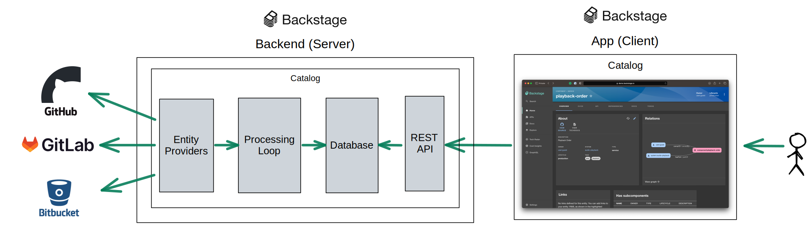
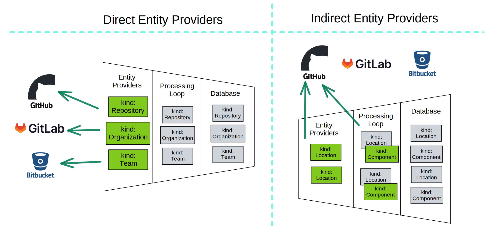

The concept of a single glass pane is popular in the Cloud Native ecosystem because it promises to prevent fragmentation within many platforms where users have to interact with different systems to get their work done. Instead of going to one interface to see their builds, another to see their deployments, and yet another to see their logs, a single glass pane would make all of this information available in one place. Increasingly, organizations building platforms see Backstage as the one place to surface everything developers need to be productive.

Backstage is well positioned to be the single glass pane because it offers a user-friendly architecture designed with this in mind and a suite of plugins that make it easier to integrate with external systems. This blog post will review the Backstage architecture and cover seven separate ways to integrate with external systems to form a single glass pane in Backstage:

1. Explore Backstage Plugin
2. Entity Links
3. Custom React Component
4. Proxy Backstage Plugin
5. Custom Backend Plugin as a Gateway
6. Custom Processor
7. Custom Entity Provider

Each approach is valid and has both benefits and tradeoffs. Picking the most suitable approach depends on several factors related to security and integration complexity. This list is organized in order of increasing complexity, but as the complexity increases, so does the value you get from the integration. For first-time users, we recommend starting with the least complex integration as it will take the least time and effort while still delivering value. Based on the feedback you get from users, over time you can increase your integration complexity to generate more value.

## Background

Backstage has a fairly traditional client-side architecture with a sprinkle of a framework to make integrating easier.

A user interacts with the Backstage App via their browser. The Backstage App is a React-based Single Page Application. It consists of Backstage Plugins, each of which is a React Component. Each React Component can retrieve data by calling the Backstage Backend or calling external services directly.

The Backstage Backend is a Node.js service that uses Express.js to mount Backstage Backend plugins on the `/api` endpoint. There are several core plugins (like Catalog and Proxy plugins) that can be configured via TypeScript or YAML. The Backend plugins call external services via a variety of different protocols. The most common is HTTP, but there is no limit to the services that Backstage Backend plugins can connect to.

## Option 1: Explore Backstage Plugin

One of the most important goals of a single glass pane approach is to give users a unified view of the internal developer platform. This is achieved by using Backstage as a launch pad into the platform by making links to all external services available in Backstage. In effect, this means gathering and listing links to external services in the Backstage App. This is so simple and obvious that it’s easy to overlook how valuable this is for users. One of our clients had a user who maintained a list of 150 links that they shared with others. Without these links it was challenging to do their work. If you’re considering creating a single glass pane, your organization likely is experiencing a similar challenge.

The easiest way to add a list of links to external services is to use the [Explore Plugin](https://github.com/backstage/backstage/tree/master/plugins/explore). It allows you to show a list of cards for each service with a link and organize these links into tabs. Instead of maintaining a list of links in say a Google Doc, developers will conveniently find these links in the Backstage portal.

## Option 2: Entity Links

The Explore Backstage Plugin is helpful when linking to a webpage on an external service, but usually those external services have information related to a specific component in your catalog. For example, if your platform offers Kibana for viewing logs, you can add a link from Explore Backstage Plugin to Kibana’s home page. However, the user will still need to navigate Kibana to find the logs of a specific component. Navigating an external service from its home page is very time-consuming and difficult for users unfamiliar with these systems.

A single glass pane can make it easier for users to navigate to specific pages in external services by providing URLs in the links property of the entity’s metadata. Backstage Catalog will show these links in the Links card on the Entity Page for that component. This technique provides native security protection by allowing the external system to ensure that the user is authenticated when the user arrives at the external system.

## Option 3: Custom React Component

An Entity Links Card is helpful when you want to show a simple list of links, but the user has to leave Backstage to see the content behind those links. This can be inefficient because it requires context switching to even simply glance at the information behind a link. We can provide a better user experience by embedding the information from the external service in the catalog’s Entity Page.

If we use Kibana as an example, instead of deep linking to a page on Kibana, we could fetch the last 100 log messages and display them directly on the Entity Page of a service component. A custom React Component would be responsible for making an API call to Kibana’s API and showing the returned information in the browser.

## Option 4: Proxy Backstage Plugin

Making API requests from a Custom React Component directly an external service is convenient when the user can authenticate directly against the external service and retrieve a token that can be used securely in the browser. Most services do not provide in-browser authentication. In this case, you can use Backstage’s Proxy plugin to call the external service on behalf of the user using a token stored in the Backstage Backend configuration.

Several Backstage Plugins integrate with external services this way (if you’re looking for inspiration on implementing this kind of integration, check out the [CircleCI Backstage Plugin](https://github.com/backstage/backstage/tree/master/plugins/circleci)). However, be aware that once you configured the proxy plugin using a Backstage specific token, that token can be used by anyone who can call `/api/proxy/<your_service>` endpoint. Take care not to leak any information that should not be available to everyone authenticated with Backstage.

## Custom Backend Plugin as a Gateway

There are various reasons why using the Backstage Proxy Plugin method to expose information to the Backstage App might not be enough. If you want to restrict the information users can retrieve from an external service, format the retrieved information, or combine information from multiple sources, a simple proxy is not enough. In these cases you need a custom Backstage plugin that is a gateway to your external service.

This gateway will respond to requests coming from the front end. It can inspect the requests to see if the user has permission to ask for the information they are requesting, make the necessary calls, format the retrieved response, and return everything as a single response.

## Option 6: Custom Processor

The five options we described so far all require a browser to access information in the external system. Some external systems (like LDAP) cannot be accessed from the browser. Integrating these kinds of systems while building a single glass pane with Backstage requires a different approach. Since accessing this information is not possible, we can instead use the Catalog’s REST API as a temporary cache. This cache is populated using Backstage Catalog’s processing loop. 

You can configure the processing loop using [Custom Processors](https://backstage.io/docs/features/software-catalog/external-integrations#custom-processors). Custom Processors run on every entity stored in the catalog and can connect to external services to retrieve additional information. The retrieved information can then be used to enrich the entity. However, you must take care to ensure that you do not perform unnecessary asynchronous operations in your Custom Processors because it can eventually slow down the processing speed of other entities.

## Option 7: Custom Entity Provider

A Custom Processor can enrich existing entities, but where do entities come from in the first place? Entities come from [Entity Providers](https://backstage.io/docs/features/software-catalog/external-integrations#custom-entity-providers). An Entity Provider is an extension point of the Catalog that allows you to commit new entities to the processing loop. Entity Providers extract information from external services, format them as entities and commit them for processing. Entities committed by Entity Providers will execute each Custom Processor relevant to that entity kind.

Entity Providers follow two ingestion strategies: direct or indirect. Indirect Entity Providers discover URLs of possible sources of entity information and commit discovered URLs as an entity of Location kind. Indirect Entity Providers in Backstage usually discover catalog-info.yaml files and expect Custom Processors to actually read these files and extract entities from them.

## Conclusion

In this blog post, we covered an overview of the Backstage architecture and seven separate ways to integrate services into Backstage to create a single glass pane. In future blog posts, we’ll expand on techniques you can use to create a single glass pane with a unified data graph of all developer assets.

_If you would like Frontside to help your team put these techniques into practice, check out our [Backstage Enterprise Support](/backstage/support/) and [consulting](/consulting) services._