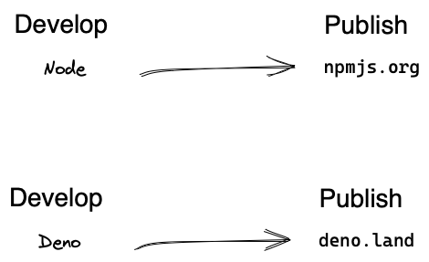
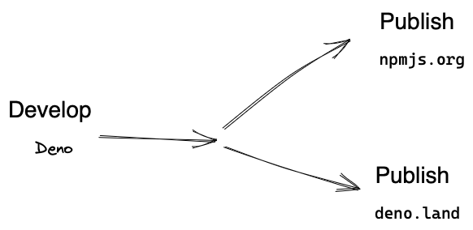

> **TL;DR** Even if you primarily run your JavaScript in Node, Deno is a
> fantastic tool for building and distributing packages on NPM (and
> everywhere else). This article shows how to publish modules to both
> https://deno.land/x and https://npmjs.org using nothing more than
> the deno CLI.

**myth**: You need to use node and npm , yarn , pnmp , etc., to publish packages
to https://npmjs.org

**Fact**: Deno is perfectly capable of maintaining NPM packages. Studies
conclusively show that maintaining NPM packages with Deno instead of Node is up
to 900% more stress free.

As you may or may not know, here at Frontside [we’re migrating toward
Deno as our primary tool for JavaScript
development][deno-blazing]. That means that we’ll not only use Deno
from the get-go to develop our new JavaScript projects and publish
them to [deno.land][], but over time we’ll also migrate our existing
repositories that use Node as the primary development tool. But that
doesn’t mean we’re rejecting the Node ecosystem – far from it!

We have a ton of NPM packages [already][graphgen]
[developed][effection] that [we][interactors] and [our
clients][ldap-simulator] critically [rely on][auth0-simulator]. Moving
forward we want all of our new packages to be available to all
JavaScript developers, not just those that happen to run their
programs on Deno. And finally there is our work with
[Backstage][backstage], which comprises the lion’s share of our
business. It runs on Node and will do so for years to come. In a
nutshell: we have been and are going to continue to be deeply
integrated with the Node community for the long haul.

But given this, how will we swap over to use Deno without
losing what we have in terms of our existing install base of NPM
packages and Node applications? Simple intuition tells us we should
use Node to develop Node packages and Deno to develop Deno modules:



But as it turns out, Deno has excellent capabilities to build NPM
packages that we use every day, allowing us to both have our cake and
eat it too. With a slight tweak to how we think about versioning, we
can get all the DX goodness of Deno, but our code is accessible to the
widest possible audience of developers on both deno.land and NPM.



The key change in thinking that enables this transition is to move
away from package.json as the final source of truth regarding the
package version and to replace it instead with a humble git tag. Each
released version will have a single tag to represent it, with the
result that package.json goes from being authoritative to just another
build artifact. In short, moving forward we’re following this mantra:
If it doesn’t have a tag, it ain’t a release.


## Tag once. Publish twice.

With that mental shift in place, we can implement the following
scheme:

1. Wait until a release tag is pushed
1. Then use it to build and publish to both deno.land/x and npmjs.com

We’ll spend the rest of this blog post showing how we will do this for
both platforms.

### Stage 1: The release tag

For all projects, a release tag is a combination of a “version prefix”
followed by a semantic version number. The most common version prefix
is the letter ‘"v"’, so for example, the semantic version `1.3.5` would be
tagged with `"v1.3.5"` . The beta version `1.6.0-beta.3` would be tagged
with `"v1.6.0-beta.3"`.

>💡 While `"v"` is the most common version prefix for a single module,
> monorepos that contain multiple distributed modules will need to use
> a more specific version prefix for tags like `“package-a-v,”` which
> will result in release tags like `package-a-v2.0.0`

### Stage 2: Build and Publish

#### 2.1: Publish to deno.land

The [deno.land][] build/publish is almost a gimme since it uses git
tags natively. All we have to do is create and register the webhook
for our module and we’re done!  Moving forward, every time
[deno.land][] sees a release tag, it will snapshot our source at that
tag and make that version available to users – in perpetuity.

#### 2.2: Publish to NPM

There’s a little more work to be done getting our package onto NPM,
but with a helping hand from Deno, we can do it in just two steps:

1. Write a script to take a version number and build an NPM package corresponding to it.
1. Implement a GitHub workflow to listen for a release tag and then invoke the script from (1) to build the package and publish it to https://npmjs.org

You might be asking yourself, “How are we going to take a bare ESM
module implemented in _TypeScript_ and just whip up a script that does
all the things needed to end up with a valid NPM package?”

The short answer is that the script practically writes itself! That's
    because Deno has our backs with a brilliant little tool called [dnt][dnt] or
**D**eno to **N**ode **T**ransform. [dnt][] is downright amazing, and its capabilities
are way undersold. Whether we're creating a new package that we want
to publish everywhere or we are just migrating repositories from Node
to Deno, [dnt][] is the secret sauce we use that does all the heavy
lifting for us.

[dnt][] works by taking a single ES module entry point as the input and
generating a feature-complete NPM package containing all its exports
as the output. Along the way, it does all the terrible, tedious,
un-fun, and error-prone things you hate about NPM-ing, such as
maintaining the list of dependencies, compiling typescript, generating
source maps and typings files, creating both commonjs as well as esm
builds, and optionally vendoring any dependencies. The results work
for users consuming the package from TS, JS, on the browser or the
node – including every possible combination of those – and you didn't
have to think about any of it. Magic!

I won’t go into all of the details because the [dnt setup
instructions][dnt-setup] are very thorough, but as an example, look at
our build script at
[tasks/build-npm.ts](https://github.com/thefrontside/graphgen/blob/v1.8.1/tasks/build-npm.ts)
in the [GraphGen][graphgen] repository. It can build any version of
our package, but here’s how we would invoke it to build version
`1.0.0`

```
$ deno run -A tasks/build-npm.ts 1.0.0
[dnt] Transforming...
[dnt] Running npm install...
added 6 packages, and audited 7 packages in 1s
found 0 vulnerabilities
[dnt] Building project...
[dnt] Emitting declaration files...
[dnt] Emitting ESM package...
[dnt] Emitting script package...
[dnt] Complete!
```

Now that we have the script to build an NPM package from source, the
only remaining step is to add a GitHub workflow to be able to call
it. The gist of it is this:

1. [Listen for any tag that matches our release pattern](https://github.com/thefrontside/graphgen/blob/v1.8.1/.github/workflows/npm-release.yml#L4-L9)
2. [Capture the target version number based off the tag that triggered the workflow](https://github.com/thefrontside/graphgen/blob/v1.8.1/.github/workflows/npm-release.yml#L28-L30)
3. [Invoke our dnt script to build an NPM package corresponding to the captured version number](https://github.com/thefrontside/graphgen/blob/v1.8.1/.github/workflows/npm-release.yml#L39-L42)
4. [Publish the built package to https://npmjs.org](https://github.com/thefrontside/graphgen/blob/v1.8.1/.github/workflows/npm-release.yml#L44-L48)

It’s about as straightforward as a GitHub workflow can get, and with
it in place, we can now publish to two locations – just by creating a
tag. (Trust me, it feels even easier when you try it yourself.)

## Conclusion

Like many JavaScript developers, we have a heavy investment in the
Node ecosystem, which means that we rely on NPM to distribute most of
our code. However, because of Deno’s excellent support for NPM and NPM
distribution, we’ve been able to forge ahead with migrating more and
more of our repositories so they can use Deno as their primary
JavaScript development tool – without sacrificing any of our NPM
audience. Not only is Deno perfectly capable of managing NPM packages,
but from our point of view it is actually a more pleasant experience
than doing so with Node itself.  I hope I’ve shown that if you’re
thinking of giving Deno a spin it isn’t an either/or proposition. You
can happily develop with Deno yet still publish your code to NPM,
where it can be consumed just the way it always was by applications
running on Node. That means that you can adopt it incrementally at a
pace that makes sense for you and your organization.

So what are you waiting for?

[deno-blazing]: https://frontside.com/blog/2022-12-01-deno-is-blazing-fast-for-humans/
[deno.land]: https://deno.land/x
[interactors]: https://www.npmjs.com/package/@interactors/core
[graphgen]: https://www.npmjs.com/package/@frontside/graphgen
[effection]: https://www.npmjs.com/package/effection
[ldap-simulator]: https://www.npmjs.com/package/@simulacrum/ldap-simulator
[auth0-simulator]: https://www.npmjs.com/package/@simulacrum/auth0-simulator
[backstage]: https://backstage.io
[dnt]: https://github.com/denoland/dnt
[dnt-setup]: https://github.com/denoland/dnt#setup
[graphgen]: https://frontside.com/graphgen
