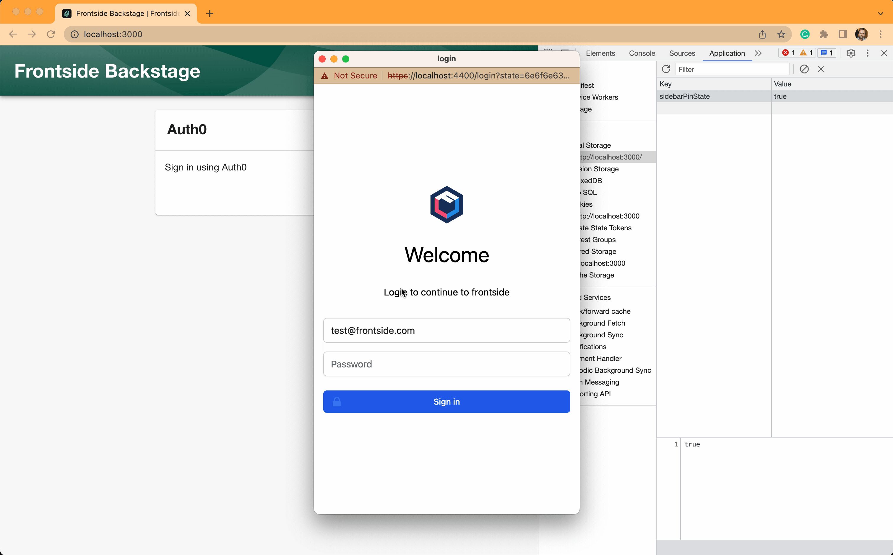

This is a very quick blog post to show how you can invoke code custom source code after the user signs out from Backstage. We'll use an example where we store a user entity ref in local storage after a user signs in and we'll clear the local storage after the user signs out. Without any further ado, let's get started.

First, let's set up the `SignInPage` to show the user the Auth0 sign-in screen. I'm using Auth0 because that's what we use to authenticate users in our Backstage instance. Your configuration will be different but the approach should be the same. In `packages/app/src/App.tsx`, we're going to add the `SignInPage` component to `const app = createApp` section.

```tsx
const app = createApp({
  apis,
  components: {
    SignInPage: props => (
       <SignInPage
         {...props}
         auto
         provider={{
           id: 'auth0-auth-provider',
           title: 'Auth0',
           message: 'Sign in using Auth0',
           apiRef: auth0AuthApiRef,
         }}
       />
     ),
    },
  },
  // ✄ the rest of the code for bravity, but you need it in your app
});
```

The `{...props}` contains a property called `onSignInSuccess`, it's called by the `<SignInPage` component when the user authenticates successfully. We can override this property to invoke custom code. Before we handle clean-up, let's add the code that'll write the entity ref to local storage using the storage API provided by Backstage.

```tsx
const app = createApp({
  apis,
  components: {
    SignInPage: props => {
      // this will give us the storage object that we can use to interact with local storage
      const storage = useApi(storageApiRef);

      return (
        <SignInPage
          onSignInSuccess={async (identityApi: IdentityApi) => {
            // first, authenticate the user
            props.onSignInSuccess(identityApi);

            // afterwards, get the authenticated user information
            const identity = await identityApi.getBackstageIdentity();

            // set the userEntityRef into 'authenticated/user' key in local storage
            storage.set('authenticated/user', identity.userEntityRef);
          }}
          auto
          provider={{
            id: 'auth0-auth-provider',
            title: 'Auth0',
            message: 'Sign in using Auth0',
            apiRef: auth0AuthApiRef,
          }}
        />
      );
    },
  },
  // ✄ the rest of the code for bravity, but you need it in your app
});
```

The `identityApi` object has four methods on it. One of those methods is called `signOut`. Invoking this method will sign out the user. To hook into this method, we need to wrap it in a function that we can use to add custom code. We need to make sure that all of the rest of the methods still work, so we'll wrap them but they will just call the original object.

```tsx
const app = createApp({
  apis,
  components: {
    SignInPage: props => {
      const storage = useApi(storageApiRef);

      return (
        <SignInPage
          onSignInSuccess={async (identityApi: IdentityApi) => {
            // creating a new object and passing it to `onSignInSuccess`
            props.onSignInSuccess({
              // pass-through getProfileInfo, getBackstageIdentity and getCredentials
              // they will just call the original method with the same name
              getProfileInfo() {
                return identityApi.getProfileInfo();
              },
              getBackstageIdentity() {
                return identityApi.getBackstageIdentity();
              },
              getCredentials() {
                return identityApi.getCredentials();
              },
              async signOut() {
                // call signOut() to perform actual signOut logic
                await identityApi.signOut();
                // happens after signout
                storage.remove('authenticated/user');
              },
            });
            // happens after successful authentication

            // afterwards, get the authenticated user information
            const identity = await identityApi.getBackstageIdentity();

            // set the userEntityRef into 'authenticated/user' key in local storage
            storage.set('authenticated/user', identity.userEntityRef);
          }}
          auto
          provider={{
            id: 'auth0-auth-provider',
            title: 'Auth0',
            message: 'Sign in using Auth0',
            apiRef: auth0AuthApiRef,
          }}
        />
      );
    },
  },
  // ✄ the rest of the code for bravity, but you need it in your app
  },
});
```

In the code above, we're creating a new object with four methods, just like the original `identityApi`. We didn't change the logic of `getProfileInfo`, `getBackstageIdentity` and `getCredentials`, instead, we just call the original method. These methods will behave the same way as the original `identityApi` methods. We only changed the logic of the `signOut` method. We made it *async* to be able to use `await` keyword; then we invoked the original method and called our custom code.

This is the entire solution for calling code after sign-in and sign-out. If you have any questions, feel free to ping us in Backstage Discord.
